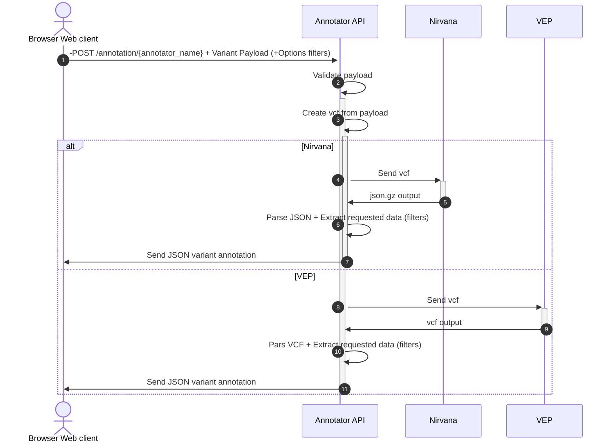

# bio-annotator

```mermaid
  sequenceDiagram
    actor B as Browser Web client
    participant S as Annotator API
    participant N as Nirvana
    participant V as VEP
    autonumber
    B->>+S: -POST /annotation/{annotator_name} + Variant Payload (+Options filters)
    S->>+S: Validate payload
    S->>+S: Create vcf from payload
    alt Nirvana
	    S->>+N: Send vcf
        N->>-S: json.gz output
        S->>S: Parse JSON + Extract requested data (filters)
        S->>-B: Send JSON variant annotation
    else VEP
	    S->>+V: Send vcf
        V->>-S: vcf output
        S->>S: Pars VCF + Extract requested data (filters)
        S->>-B: Send JSON variant annotation
    end
```

