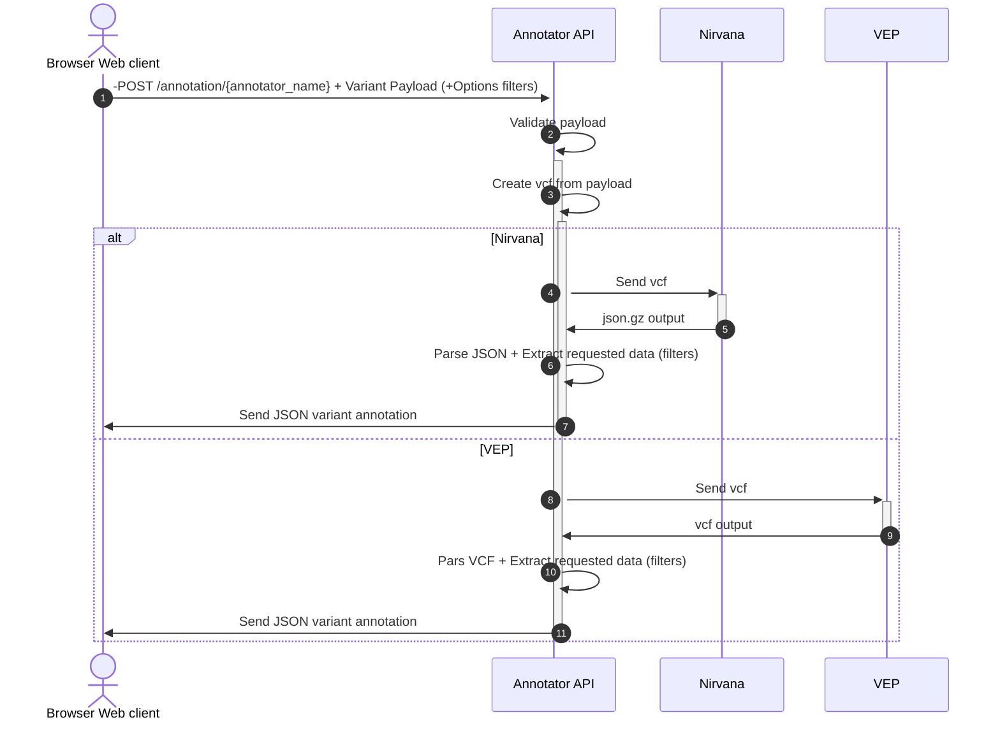
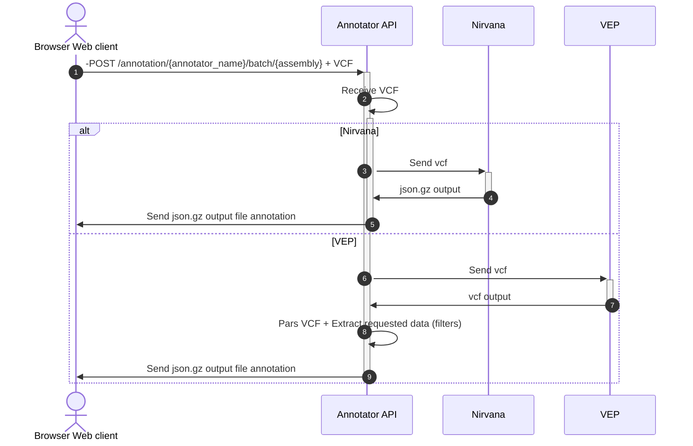

# bio-annotator

## Introduction

#### This package can be used either as a library or as a REST API service
#### As a library it is a proxy for Annotation tools such as [VEP CLI](https://github.com/Ensembl/ensembl-vep) and [Nirvana](https://github.com/Illumina/Nirvana)
#### As a REST API it is a full asynchronous REST API with a built-in cache system for improving performance
#### Either by using it as a LIbrary or a REST API, it has two main workflow : 

- single variant annotation 
- batch file upload

## Single variant annotation flow:

## Batch Upload flow

