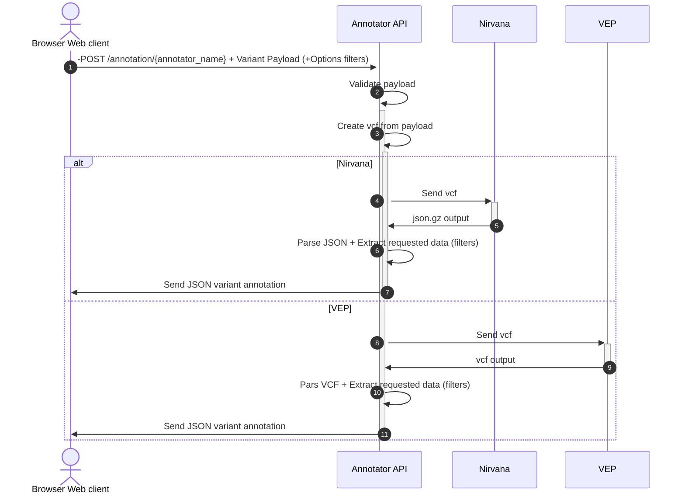
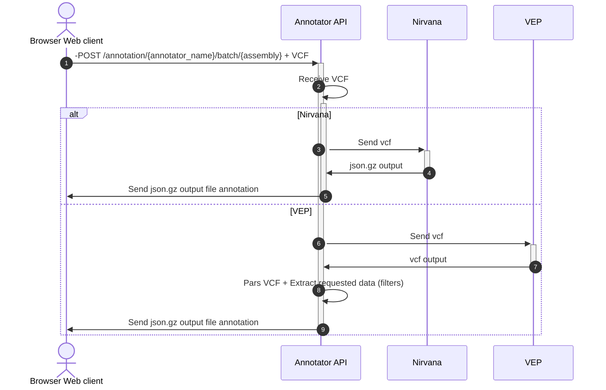

# bio-annotator

## Introduction

#### This package can be used either as a library or as a REST API service
#### As a library it is a proxy for Annotation tools such as [VEP CLI](https://github.com/Ensembl/ensembl-vep) and [Nirvana](https://github.com/Illumina/Nirvana)
#### As a REST API it is a full asynchronous REST API with a built-in cache system for improving performance
#### Either by using it as a LIbrary or a REST API, it has two main workflow : 

- single variant annotation 
- batch file upload

## Single variant annotation flow:



## Batch Upload flow

## User Installation Guide (REST API)

In order to use this service, you must download some data first (either from Nirvana or VEP, they are both using their own files to annotate variants)
Example for Nirvana :

`docker pull annotation/nirvana:3.14`

then

`sudo docker run --rm -it -v Data:/scratch annotation/nirvana:3.14 dotnet \
     /opt/nirvana/Downloader.dll --ga GRCh37 -o /scratch`

Then the best way for using this tool is by running the `Dockerfile`. 

`docker run -p 5001:5000 -v Data:/scratch bio-annotator ` 

## Example of single variant annotation

Send this

```bash
curl -X 'POST' \
  'http://0.0.0.0:5001/api/annotation/v1/annotation/nirvana' \
  -H 'accept: application/json' \
  -H 'Content-Type: application/json' \
  -d '{
  "variant_type": "SNV",
  "chromosome": "5",
  "human_reference": "GRCh37",
  "start": 120000,
  "end": 0,
  "ref": "G",
  "alt": "T",
  "version": 0,
  "options": {
    "hgvs": true
  }
}'
```

And you'll get this output:

```json
{
  "header": {
    "annotator": "Nirvana 3.13.0",
    "creationTime": "2023-01-22 04:25:50",
    "genomeAssembly": "GRCh37",
    "schemaVersion": 6,
    "dataVersion": "91.27.61",
    "dataSources": [
      {
        "name": "VEP",
        "version": "91",
        "description": "BothRefSeqAndEnsembl",
        "releaseDate": "2017-12-18"
      },
      {
        "name": "MultiZ100Way",
        "version": "20150427",
        "description": "Amino acid conservation scores calculated from MultiZ100Way alignments from UCSC.",
        "releaseDate": "2015-04-27"
      },
      {
        "name": "ClinVar",
        "version": "20200302",
        "description": "A freely accessible, public archive of reports of the relationships among human variations and phenotypes, with supporting evidence",
        "releaseDate": "2020-03-02"
      },
      {
        "name": "dbSNP",
        "version": "153",
        "description": "Identifiers for observed variants",
        "releaseDate": "2019-07-22"
      },
      {
        "name": "dbSNP",
        "version": "151",
        "description": "Identifiers for observed variants",
        "releaseDate": "2018-04-23"
      },
      {
        "name": "gnomAD",
        "version": "2.1",
        "description": "Allele frequencies from Genome Aggregation Database (gnomAD)",
        "releaseDate": "2018-10-17"
      },
      {
        "name": "MITOMAP",
        "version": "20200224",
        "description": "Small variants in the MITOMAP human mitochondrial genome database",
        "releaseDate": "2020-02-24"
      },
      {
        "name": "1000 Genomes Project",
        "version": "Phase 3 v5a",
        "description": "A public catalogue of human variation and genotype data",
        "releaseDate": "2013-05-27"
      },
      {
        "name": "PrimateAI",
        "version": "0.2",
        "description": "PrimateAI percentile scores.",
        "releaseDate": "2018-11-07"
      },
      {
        "name": "REVEL",
        "version": "20160603",
        "description": "Pathogenicity scores of missense variants predicted by REVEL",
        "releaseDate": "2016-06-03"
      },
      {
        "name": "SpliceAI",
        "version": "1.3",
        "description": "SpliceAI scores, distances, etc.",
        "releaseDate": "2019-10-04"
      },
      {
        "name": "TOPMed",
        "version": "freeze_5",
        "description": "Allele frequencies from TOPMed data lifted over using dbSNP ids",
        "releaseDate": "2017-08-28"
      },
      {
        "name": "ClinGen",
        "version": "20160414",
        "releaseDate": "2016-04-14"
      },
      {
        "name": "ClinGen Dosage Sensitivity Map",
        "version": "20200131",
        "description": "Dosage sensitivity map from ClinGen (dbVar)",
        "releaseDate": "2020-01-31"
      },
      {
        "name": "MITOMAP_SV",
        "version": "20200224",
        "description": "Large structural variants in the MITOMAP human mitochondrial genome database",
        "releaseDate": "2020-02-24"
      },
      {
        "name": "1000 Genomes Project (SV)",
        "version": "Phase 3 v5a",
        "description": "A public catalogue of human variation and genotype data",
        "releaseDate": "2013-05-27"
      },
      {
        "name": "gnomAD_gene_scores",
        "version": "2.1",
        "description": "Gene Loss of function scores from Genome Aggregation Database (gnomAD)",
        "releaseDate": "2018-10-17"
      },
      {
        "name": "ClinGen disease validity curations",
        "version": "20191202",
        "description": "Disease validity curations from ClinGen (dbVar)",
        "releaseDate": "2019-12-02"
      },
      {
        "name": "OMIM",
        "version": "20200409",
        "description": "An Online Catalog of Human Genes and Genetic Disorders",
        "releaseDate": "2020-04-09"
      },
      {
        "name": "phyloP",
        "version": "hg19",
        "description": "46 way conservation score between humans and 45 other vertebrates",
        "releaseDate": "2009-11-10"
      },
      {
        "name": "MitochondrialHeteroplasmy",
        "version": "20180410",
        "description": "Variant read frequency percentiles for the Mitochondrial reference",
        "releaseDate": "2020-05-21"
      }
    ]
  },
  "positions": [
    {
      "chromosome": "5",
      "position": 120000,
      "refAllele": "G",
      "altAlleles": [
        "T"
      ],
      "cytogeneticBand": "5p15.33",
      "variants": [
        {
          "vid": "5-120000-G-T",
          "chromosome": "5",
          "begin": 120000,
          "end": 120000,
          "refAllele": "G",
          "altAllele": "T",
          "variantType": "SNV",
          "hgvsg": "NC_000005.9:g.120000G>T",
          "phylopScore": -0.1,
          "transcripts": [
            {
              "transcript": "ENST00000512035.1",
              "source": "Ensembl",
              "bioType": "lincRNA",
              "introns": "2/2",
              "geneId": "ENSG00000249430",
              "hgnc": "CTD-2231H16.1",
              "consequence": [
                "intron_variant",
                "non_coding_transcript_variant"
              ],
              "hgvsc": "ENST00000512035.1:n.324+6437G>T",
              "isCanonical": true
            }
          ]
        }
      ]
    }
  ]
}
```

